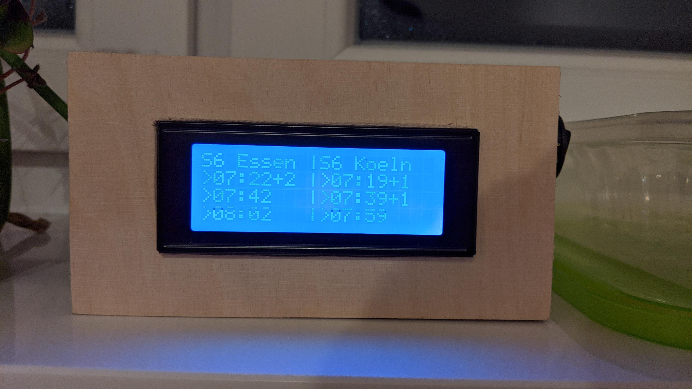

# VRR Monitor

VRR monitor display for my train stop, to keep track of S-Bahn delay in the morning based on ESP32.

- Queries data from marudor.de
- Display current waiting time on Serial and I2C Display
  - 20x4 Liquid Crystal display

Project is based on my [digitransit-busstop-sign](https://github.com/stetro/digitransit-busstop-sign)

## Partlist

For the basic usage only the NodeMcu and LCD display is needed.

* NodeMCU ESP32 
* LCD Display 20x4 with I2C Adapter
* [Power Switch Button]
* [Lithium Ion Battery 3.7]
* [5V stepup board with charging circuit]

